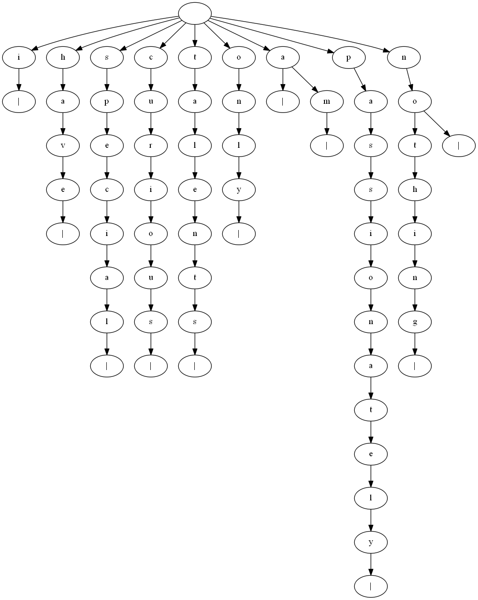
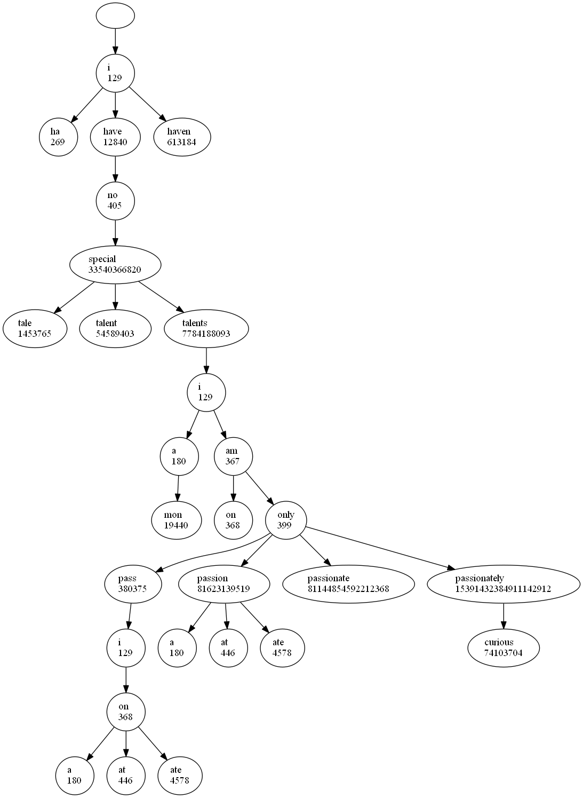
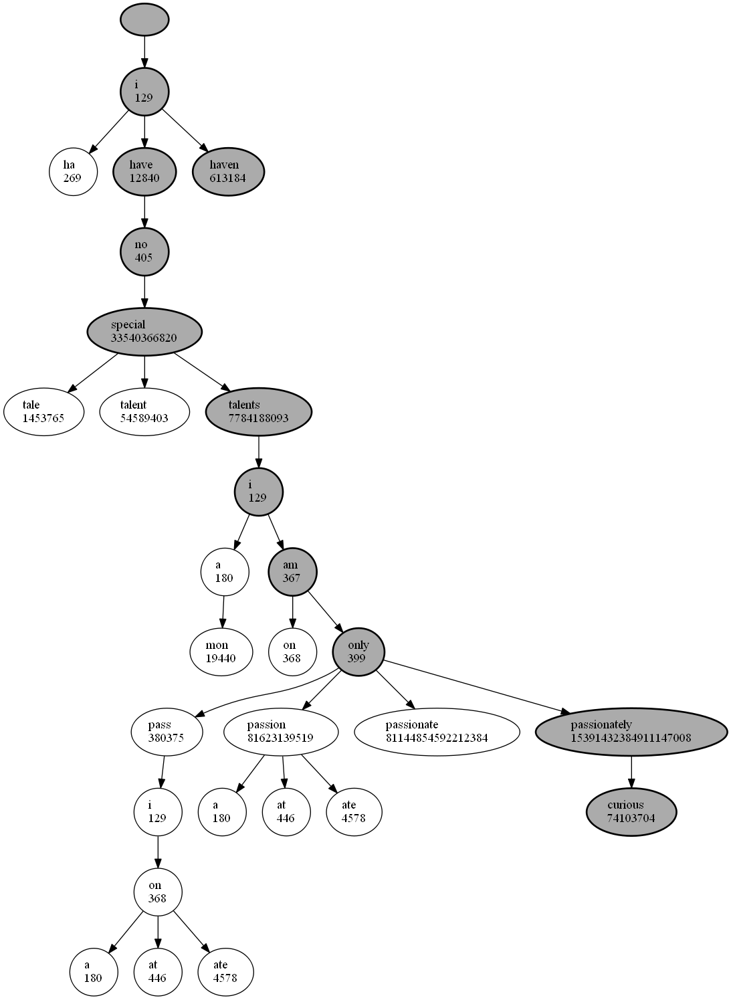

# Word Separator

Applying Natural Language Processing concepts to split a string based on the words it contains.

### Example

If we have a String of words as follows:

```
ihavenospecialtalentsiamonlypassionatelycurious
```

At first, it can be difficult to decipher, however, after some time, we'll see that the message is actually the famous quote from Albert Einstein:

```
i have no special talents i am only passionately curious
```

The exercise and challenge is to automate this process. This is explained in the **Theory** and **Implementation** sections below.

## Theory

In order for an algorithm to be able to break apart strings of words with no spaces, it will need some way of knowing how "valid" certain words are. To do this, we'll first need to acquire a large text sample in the language of the string we'd like to break apart. In this case that would be English. With this large text sample, we will split by white space (' ') to create a list of words. We'll standardize the data by making everything lowercase and removing all punctuation. Using this, we'll gather some important data from the words.

* We'll keep track of the length of words. We'll count how many times words of a certain length appear.
* We'll keep track of the number of times a certain letter is the first letter of a word, and the number of times letters are the last letter of a word.
* We'll keep track of the frequency of each letter in the sample text.
* We'll track the number of times certain letters are directly followed by other letters in a matrix.
* We'll also keep track of the words themselves.

Now that we've done some data processing, we need to figure out how to use it. First, we'll keep track of all the letters in an acyclic directed graph as shown below. The figure below is an example of what such a graph would look like for the words found in Einsteins quote above along with the words `a` and `nothing` to better illustrate how the graph is used.



<br />

As we can see, as we go down a certain path in the graph, we build up a word. The actual default data set used for this project contains 26756 words, however the `.json` file the graph is stored in is only 776 kB, so this is a memory efficient approach. Unfortunately, however, this means that we can only use this algorithm for words that the algorithm has seen before.

Now we can use this data structure to build up words in the input string. We loop through the string letter by letter, traversing the letter graph shown above as we go. When we find matches, we keep note. Whenever a child node of a node contains the `|` character, we know that the word we've built up until that point is a valid word. We continue to traverse the graph until we've reached the end of a path. We keep track of all these matches in a list, and once we've gone as far as we can, we loop through each item in the list, removing this item from the beginning of the input string and repeating the process.

This process will yield a graph that looks something like the one shown below. Keep in mind that this graph was generated using the full 26756 words of the original dataset.



<br />

As we can see, there are numbers next to each word possibilities. These represent the "score" this word gets. To calculate the score of a word, we follow these steps:

1. We loop through every letter of the word, finding the number of times the current letter was followed by the next letter by looking it up in the matrix described above. We multiply all these numbers together and keep track of this number as the `score`. This method favors longer words, which is exactly what we want as longer words typically are made up of several shorter words. We want to keep the word length as long as possible.
2. We add the number of times the first letter of the word was the first letter of the words in the data set to the `score`.
3. We add the number of times the last letter of this word was the last letter of the words in the data set to the `score`.
4. Finally, we add the number of times a word of this words length occured in the data set and add it to the `score`. 

<br />

Now that we have this graph, we'll use a modified version of Dijkstra's algorithm. At each node of the graph, we always choose the child node with the highest score. We continue to do this until we have succesfully built up the input string, or if we hit a dead end. In the case that we encounter a dead end, we re-trace our steps and try the next largest child node and go from there. The graph above has a simple traversal that is shown below:



<br />

## Implementation

First, we need to get our data. I chose the website http://textfiles.com/stories/ which contains hundreds of long classic tales. The `parse.py` script used multi-threading to extract these stories in parallel, reducing wait time. All of these stories are processed (punctuation removed, made lowercase, etc) and then turned into `words.csv`, which shows each unique word and it's count.

`process.py` will now process `words.csv` using the `pandas` library. Words that only appear once are removed as those are presumed to be typos in the text. Additionally, these stories contain some crazy tales, so there are some unusual words that would throw off the algorithm when trying to decipher modern english. Therefore, words that have length 2 and occur less than 100 times and all words that appear less than 15 times in total or whose length is less than 5 are filtered out. We then create `word_length.csv` which contains word lengths mapped to their count. 

### `word_length.csv`

To make numbers manageable, all values are percentages multiplied by 1000.

Word Length | Count
--- | ---
3 | 229.70764733302488
2 | 166.5283257982326
6 | 86.58694304803923
5 | 120.04983737005634
7 | 70.95124798481544
... | ...

We create `letters.csv` which keep track of the number of times a certain letter is the first letter of a word, the number of times letters are the last letter of a word, the frequency of each letter in the sample text as well as the letter order matrix described above. 

### `letters.csv`

To make numbers manageable, all values are percentages multiplied by 1000.

Letter | Count | Begin | End | a | b | ... | z
--- | --- | --- | --- | --- | --- | --- | ---
a | 80.30959277284865 | 109.35917852672462 | 28.687679460453285 | 0.4983368315105988 | 355.7544605931703 | ... | 221.1699164345404
b | 15.103583426651735 | 45.26490110216372 | 0.8161822425776804 | 28.23335910937634 | 42.86305092756706 | ... | 0.0
c | 24.93203010595228 | 40.55091434938492 | 2.0829109460262667 | 59.51320101631255 | 0.8862105636299185 | ... | 0.3714020427112349
... | ... | ... | ... | ... | ... | ... | ...

### `letterMap.json`

Finally, we create `letterMap.json`, which keep track of each letter of each word as an acyclic directed graph. It is stored as a series of nested dictionaries in a `.json` file as shown below.

```python
{
    "a": {
        "m": {
            "|": null
        }
    },
    "c": {
        "u": {
            "r": {
                "i": {
                    "o": {
                        "u": {
                            "s": {
                                "|": null
                            }
                        }
                    }
                }
            }
        }
    },

    ...
```

We can now use these files to build up the graphs shown in the figures above and use the algorithm to find the best match. Using `letterMap.json`, we traverse the input string letter by letter and keep track of all the possible words that the input string could start with. We keep track of these options as a list. Then we loop through each item of this list, and repeat this process with this item removed from the beginning of the input string. Doing so creates the graph of possible word shown above. This is stored as a series of nested dictionaries, where the keys are the `word-score` pairing, and the values are the other options after that.

```
{
    "i-129": {
        "ha-269": {},
        "have-12840": {
            "no-405": {
                "special-33540366820": {
                    "tale-1453765": {},
                    "talent-54589403": {},
                    "talents-7784188093": {
                        "i-129": {
                            "a-180": {
                                "mon-19440": {}
                            },
                            "am-367": {
                                "on-368": {},
                                "only-399": {
                                    "pass-380375": {
                                        "i-129": {
                                            "on-368": {
                                                "a-180": {},
                                                "at-446": {},
                                                "ate-4578": {}
                                            }
                                        }
                                    },
                                    "passion-81623139519": {
                                        "a-180": {},
                                        "at-446": {},
                                        "ate-4578": {}
                                    },
                                    "passionate-81144854592212384": {},
                                    "passionately-15391432384911147008": {
                                        "curious-74103704": {}
                                    }
                                }
                            }
                        }
                    }
                }
            }
        },
        "haven-613184": {}
    }
}
```

We then traverse this dictionary layer by layer, always choosing the word with the largest score. We do this recursively so we can back track when we run into a dead end. We continue traversal until we find a path that builds up a string equal to the input. This means that if there were any words in the input that are not contained in the dataset, the algorithm will fail.

## Usage

Navigate to the project directory in the command line and enter the following command:

```
python analyze.py
```

Once you start it up, you should see something like this:

```
Welcome to the Word Separator!

Enter a string of words below.

Example:
        hellotherehowareyou -> hello there how are you

If you'd like to train the algorithm based on your own data set, place a file
containing lots of words separated by spaces in this directory and enter the file name below.
The more words there are, the better the algorithm will be.

Enter File Name (Press Enter/Return to skip):
Enter a series of words with no punctuation or spaces (Press Enter/Return to skip): hellotherehowareyou
hello there how are you
Enter a series of words with no punctuation or spaces (Press Enter/Return to skip): ihavenospecialtalentsiamonlypassionatelycurious
i have no special talents i am only passionately curious
Enter a series of words with no punctuation or spaces (Press Enter/Return to skip): thisalgorithmwilltryitsbesttocrackyourstrings
this algorithm will try its best to crack your strings
Enter a series of words with no punctuation or spaces (Press Enter/Return to skip): thiswordisnonsensedcjslcmx
Input contains words not present in words.csv. Could not break apart string.
Enter a series of words with no punctuation or spaces (Press Enter/Return to skip): 
```

## Dependencies

* [Python 3.7+](https://www.python.org/)
* [Pandas](https://pandas.pydata.org/)
* [Requests](https://requests.readthedocs.io/en/master/)
* [bs4](https://www.crummy.com/software/BeautifulSoup/bs4/doc/)

```
pip3 install pandas
pip3 install requests
pip3 install bs4
```